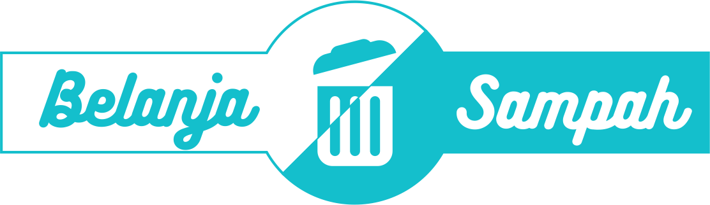

## Apa itu Belanja Sampah?

Belanja sampah adalah sebuah sistem informasi yang memungkinkan nasabah dari bank sampah untuk berbelanja di koperasi serba usaha menggunakan saldo tabungan yang mereka miliki. Nantinya sistem informasi ini mampu memfasilitasi transaksi belanja yang dilakukan oleh nasabah yang didukung dengan penggunaan sistem berbasis web sehingga memudahkan para nasabah dalam berbelanja barang kebutuhan sehari-hari. Beberapa fitur yang ada di dalam sistem informasi ini antara lain :

- Berbelanja barang-barang kebutuhan sehari-hari
- Melihat riwayat transaksi nasabah dari bank sampah
- Mendaftarkan nasabah yang dimiliki oleh bank sampah (khusus admin bank sampah)
- Mendaftarkan barang yang dijual oleh koperasi serba usaha (khusus admin koperasi)

## Mengapa saya membuat belanjasampah?

Belanjasampah ini adalah proyek percontohan yang saya ajukan dalam menyusun tugas akhir sebagai syarat kelulusan di Program D3 Sistem Informasi saya di Politeknik Negeri Bali. Namun saya berharap kedepannya konsep ini dapat dikembangkan dan dapat diwujudkan dalam suatu sistem informasi yang nyata suatu saat nanti.

## Bagaimana cari login?

Berikut ini 4 akses yang saya buat pada belanjasampah dan bisa teman-teman gunakan sebagai bahan untuk mengetes sistem informasi ini :

- Admin sistem : adminsistem (password: sistem)
- Admin koperasi : koperasi (password: 123456)
- Admin bank : adminsistem (password: 123456)
- Nasabah : adminsistem (password: 123456)
