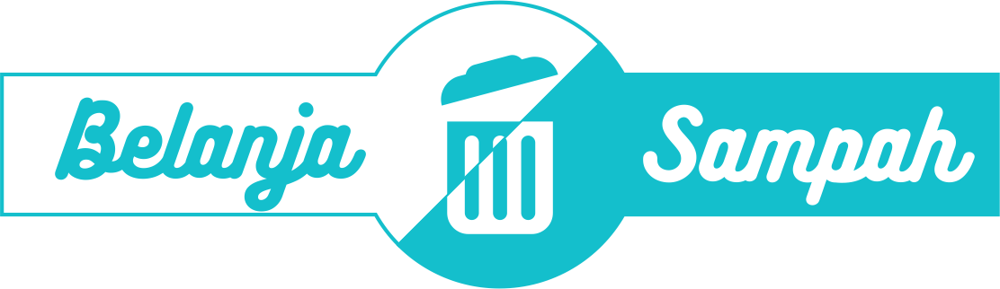

    

    
    
    
    

## Apa itu Belanja Sampah?

Belanja sampah adalah sebuah sistem informasi yang memungkinkan nasabah dari bank sampah untuk berbelanja di koperasi serba usaha menggunakan saldo tabungan yang mereka miliki. Nantinya sistem informasi ini mampu memfasilitasi transaksi belanja yang dilakukan oleh nasabah yang didukung dengan penggunaan sistem berbasis web sehingga memudahkan para nasabah dalam berbelanja barang kebutuhan sehari-hari. Beberapa fitur yang ada di dalam sistem informasi ini antara lain :

- Berbelanja barang-barang kebutuhan sehari-hari
- Melihat riwayat transaksi nasabah dari bank sampah
- Mendaftarkan nasabah yang dimiliki oleh bank sampah (khusus admin bank sampah)
- Mendaftarkan barang yang dijual oleh koperasi serba usaha (khusus admin koperasi)

## Mengapa saya membuat belanjasampah?

Belanjasampah ini adalah proyek percontohan yang saya ajukan dalam menyusun tugas akhir sebagai syarat kelulusan di Program D3 Sistem Informasi saya di Politeknik Negeri Bali. Namun saya berharap kedepannya konsep ini dapat dikembangkan dan dapat diwujudkan dalam suatu sistem informasi yang nyata suatu saat nanti.

## Mengapa harus upgrade?

Aplikasi ini saya buat pada tahun 2017 sebagai syarat untuk mendapatkan gelar D3 Manajemen Informatika di Politeknik Negeri Bali. Di tahun 2019 ini, tentunya ada banyak sekali hal yang harus saya sesuaikan mengikuti perkembangan teknologi PHP yang ada pada saat ini. Beberapa upgrade yang saya lakukan di antaranya:

- [ ] Upgrade framework Laravel (dari 5.4 ke 8)
- [ ] Refactor code (skill code saya pada tahun 2017 masih sangat _newbie_ sekali)
- [ ] Menstruktur ulang *database*
- [ ] dll (masih belum terpikirkan saat ini)

## Penutup

Saya berharap aplikasi ini bisa berguna bagi yang membutuhkannya. _Thank you_ :)
